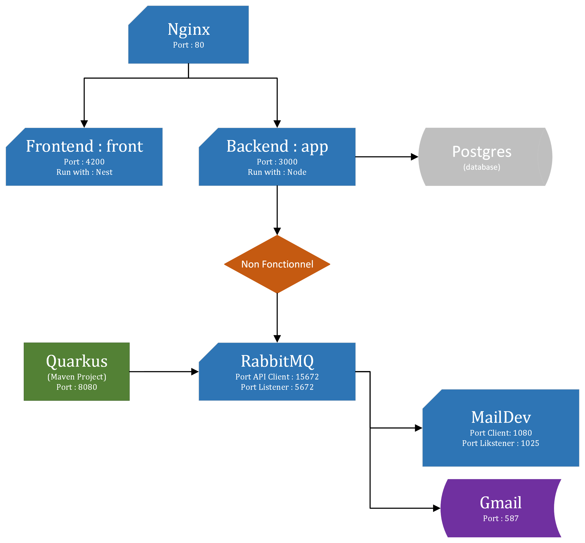

# [ESIR 2] - Projet d'AL : Architecture et microservice

ALLAIN Arthur (@Pataubeur) et DE ZORDO Benjamin (@FenrirWolf4566)

---

## I. Introduction 

**Objectif** : 
Nous avions pour but final de transformer notre projet WEB (frontend et backend) en un ensemble de microservices Docker fonctionnant ensemble et d'y incorporer un système d'envoi de mail via Quarkus gérant la queue de messages via RabbitMQ.

**Actuellement** :
- Nous avons réussi à mettre en place notre architecture *Frontend* et *Backend* sous un microservice Nginx les redirigeant vers le port 80 et avons ajouté une base de donnée Postgres.
- Quarkus communique avec RabbitMQ et permet d'envoyer des mails vers un MailDev ou bien vers une adresse Gmail (en fonction des paramètres choisis).
- La communication entre le *Backend* et RabbitMQ n'a pas pu être établie.

**Lancer le projet** :
 

Voici le diagramme d'architecture qui en résulte : 




```Ce compte rendu reprend les éléments finaux de notre projet. Nous avons eu énormément de soucis avec les dépendances et avec notre projet Web qui n'était pas terminé lors des séances de TP.``` 


```Afin de pouvoir comprendre au mieux le TP et avoir un microservice décent nous avons dû continuer chez nous pendant de nombreuses heures afin de tout débugguer.``` 


## II. Mise en Docker du projet Web

### a. Docker du front et du back
Dans un premier temps nous avons dockerisé notre projet Web sur le projet d'AL :
- Le projet Web n'était qu'à son début lorsque nous avons commencé le TP d'AL ce qui nous a fortement freiné (surtout qu'il s'agissait de notre premier projet de Web).
- D'autre part, beaucoup de configurations sont possibles sur le Web et ne sont pas vraiment claires.
- Enfin les consignes ont été données au fur et à mesure, à notre avis le projet était trop long et complexe pour le temps en TP que nous avions.
 *Backend* et *Frontend* en utilisant un fichier *docker-compose.yml* dans le but d'automatiser leur lancement.

Nous avons donc créé deux services : *api* (pour le *Backend*) et *front* (pour *Frontend*) ciblant des Dockerfiles localisés dans les dossiers de notre projet web.

Les Dockerfiles sont des fichiers de configuration que Docker va lancer ; ils permettent recréer notre architecture dans le Docker :
- *FROM node:19* : importer le module Node
- *WORKDIR /app* : créer un dossier de travail
- *COPY package.json ./* : copier le fichier contenant toutes les dépendances nécessaires au projet
- *npm install* : télécharger ces dépendances
- *npm run start* : lancer le projet


### b. Base de données

Concernant la base de données, nous avons importé une image Docker de Postgres sous un service nommé *bd*.

Il a fallu spécifier au *Backend* comment l'utiliser dans le `app.modules.ts` : 
```TypeScript
TypeOrmModule.forRoot({
      type: 'postgres',
      port: 5432,
      host: 'db',
      username: X,
      password: X,
      database: 'db',
```

### c. Reverse Proxy : Nginx

 Nginx est un serveur Web open-source et joue le rôle de reverse proxy ; c'est-à-dire qu'il va intercepter les requêtes avant de les renvoyer au front. Dans notre cas, cela permet de ne pas exposer les ports du *Backend* et du *Frontend* et de passer par le port *80* de Nginx.

Une nouvelle fois nous avons pris une image Docker et importer en tant que service dans notre `docker-compose.yml` :

Remarques sur le projet d'AL :
- Le projet Web n'était qu'à son début lorsque nous avons commencé le TP d'AL ce qui nous a fortement freiné (surtout qu'il s'agissait de notre premier projet de Web).
- D'autre part, beaucoup de configurations sont possibles sur le Web et ne sont pas vraiment claires.
- Enfin les consignes ont été données au fur et à mesure, à notre avis le projet était trop long et complexe pour le temps en TP que nous avions.

- **depends_on** : permet de lier le service à d'autre service ; ici on lie nginx au service du *front* et du *back*,
- **ports** : on ouvre les ports de Nginx (*80*) afin d'y avoir accès via le *localhost*,
- **volumes** : permet d'jouter un configuration au reverse proxy Nginx, ici de pouvoir déporter la communication de notre projet au port *80*.

> - A partir de cette étape nous nous sommes rendus compte de plusieurs problèmes dans notre *Backend* ce qui nous a obliger à chercher et à demander de l'aide à nos camarades.
> - Cela nous a fait perdre énormément de temps puisque sans cette pârtie opérationnelle, impossible de continuer.
> - Une fois les modifications faites nous avons eu accès à notre projet comme en local via le port de Nginx avec une base de donnée Posgres.


## III. Envoi de mail

Il nous était demandé de lier notre projet Web sur le projet d'AL :
- Le projet Web n'était qu'à son début lorsque nous avons commencé le TP d'AL ce qui nous a fortement freiné (surtout qu'il s'agissait de notre premier projet de Web).
- D'autre part, beaucoup de configurations sont possibles sur le Web et ne sont pas vraiment claires.
- Enfin les consignes ont été données au fur et à mesure, à notre avis le projet était trop long et complexe pour le temps en TP que nous avions.

c un système de mail automatique en utilisant Quarkus et RabbitMQ.

**Quarkus** est un module Java permettant (entre autre) de créer un système d'envoi de mail : c'est cette fonctionnalité que nous utiliserons.

**RabbitMQ** est un message broker c'est-à-dire une sorte de transporteur entre un *publisher* et un *consumer*/ Concrètement nous l'avons utilisé comme une passerelle entre notre Quarkus et notre projet Web.

### a. RabbitMQ

Dans la continuité du TP, nous avons utilisé un service Docker RabbitMQ et avons initialisé un environnement de façon à pouvoir se connecter à l'interface. Nous avons ouvert deux ports : 
- **15672** : le port client qui nous permet d'aller sur l'interface web de RabbitMQ,
- **5672** : le port listener qui permet aux autres services de communiquer avec lui.

### b. Quarkus

Malheureusement pour Quarkus nous n'avons pas pu faire de Docker. Nous avons donc créé un projet Maven nommé `quarkus-mailer` contenant la dépendance de Quarkus.

Nous avons implémenté un fichier `quarkus-mailer/src/main/java/org/acme/MailResource.java` afin de créer une fonction `sendEmail()` en reprenant les modules `smallrye` et `quarkus.mailer` :
```TypeScript
   @GET
    public Response sendEmail() {
        mailer.send(Mail.withText(
                "quarkus@mail.io",
                "Réussite",
                "Quarkus via RabbitMQ : Good !"));
        return Response.ok().build();
    }
```

D'autre part, il a fallu configurer quarkus via le fichier `resources/application.properties`. C'est ici qu'il faut écrire les données nécessaires à la connection de RabbitMQ à Quarkus.
Dans ce fichier deux configurations sont possibles : 
- la première permet l'envoi de mails via Gmail : néanmoins il faut une autorisation spécifique du compte Google qui doit envoyer mail
- la seconde permet l'envoi de mails simplement via un MailDev

### c. MailDev

Une configuration simple dans le `docker-compose.yml` nous permet de faire une interface MailDev accessible sur le port *1080*. Afin d'assurer une bonne communication, il faut préciser à Quarkus le bon port : ici il s'agit du port *1025*.

### d. Communication entre RabbitMQ et le projetWeb

Lorsqu'on lance le projet Web, on tombe sur une page de login. Celle-ci nous invite à nous connecter avec un **id** et un **password**, mais si nous ne l'avons pas notre idée était de pouvoir les envoyer par mail.

La configuration du Backend étant assez complexe et créant plusieurs erreurs que nous n'avons pas pu résoudre, nous avons décidé de nous arrêter ici.


## IV. Conclusion

Malgré le fait que nous n'avons pas vraiment atteint les objectifs du TP, nous avons compris qu'une architecture Docker pouvait être très intéressante afin de centraliser les dépendances d'un projet et de pouvoir lancer une unique commande pour lancer le projet.

D'autre part, même si nous ne l'avons pas fait :
- un mode *developpement* est intéressant pour effectuer des modifications sans avoir à rebuild les dockers constamment,
-  à l'inverse un mode *production* permet de présenter notre projet au monde tout en cachant les ports.

Remarques sur le projet d'AL :
- Le projet Web n'était qu'à son début lorsque nous avons commencé le TP d'AL ce qui nous a fortement freiné (surtout qu'il s'agissait de notre premier projet de Web).
- D'autre part, beaucoup de configurations sont possibles sur le Web et ne sont pas vraiment claires.
- Enfin les consignes ont été données au fur et à mesure, à notre avis le projet était trop long et complexe pour le temps en TP que nous avions.
